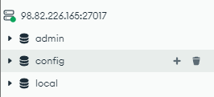
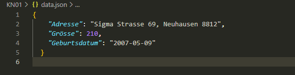
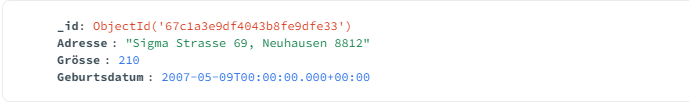
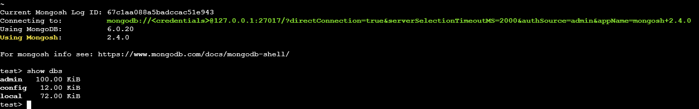
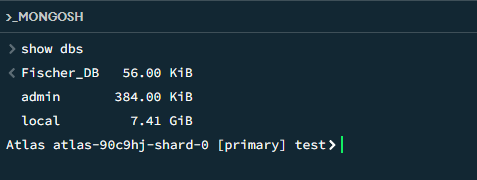

# MongoDB Konfigurationsanpassungen

## 1. Connection String und `authSource=admin`

### Was bewirkt `authSource=admin`?
Der Parameter `authSource=admin` im MongoDB Connection String gibt an, dass die Authentifizierung gegen die `admin`-Datenbank durchgeführt wird. In MongoDB werden Benutzerkonten in der `admin`-Datenbank gespeichert, selbst wenn sie Zugriff auf andere Datenbanken haben. Ohne diesen Parameter versucht der Client, sich an der Standarddatenbank zu authentifizieren, was zu Authentifizierungsfehlern führen kann, wenn der Benutzer nicht dort registriert ist.

### Beispiel Connection String:
```bash
mongodb://<IhrBenutzer>:<IhrPasswort>@<IhreIp>:27017/?authSource=admin&readPreference=primary&ssl=false
```

Durch die Angabe von `authSource=admin` wird sichergestellt, dass die Authentifizierung korrekt durchgeführt wird und der Benutzer Zugriff auf die gewünschten Datenbanken erhält.


---

## 2. Erklärung der `sed`-Befehle in der Cloud-Init Datei

### Erster `sed`-Befehl:
```bash
sudo sed -i 's/127.0.0.1/0.0.0.0/g' /etc/mongod.conf
```
**Was bewirkt dieser Befehl?**
- Ändert die Bind-Adresse in der MongoDB-Konfigurationsdatei (`/etc/mongod.conf`).
- Ersetzt `127.0.0.1` (nur lokale Verbindungen erlaubt) durch `0.0.0.0` (Verbindungen von außen erlaubt).

**Warum ist das notwendig?**
- Standardmäßig erlaubt MongoDB nur Verbindungen von `localhost`.
- Mit `0.0.0.0` kann MongoDB über das Netzwerk erreichbar sein, z. B. für externe Tools wie Compass oder Anwendungen, die auf einer anderen Maschine laufen.

### Zweiter `sed`-Befehl:
```bash
sudo sed -i 's/#security:/security:\n  authorization: enabled/g' /etc/mongod.conf
```
**Was bewirkt dieser Befehl?**
- Aktiviert den Sicherheitsblock in der Konfigurationsdatei.
- Fügt die Zeile `authorization: enabled` hinzu, um die Authentifizierung zu erzwingen.

**Warum ist das notwendig?**
- Ohne diese Einstellung könnte jeder ohne Login auf die MongoDB zugreifen, was ein erhebliches Sicherheitsrisiko darstellt.
- Durch die Aktivierung der Authentifizierung müssen sich Benutzer mit Benutzernamen und Passwort anmelden, bevor sie auf die Datenbank zugreifen können.


---

## 3. Screenshot der MongoDB-Konfigurationsdatei

### Vorgehensweise:
1. Per SSH in die Instanz einloggen.
2. Die Konfigurationsdatei öffnen mit:
   ```bash
   nano /etc/mongod.conf
   ```
   oder die relevanten Zeilen ausgeben mit:
   ```bash
   cat /etc/mongod.conf | grep -E '0.0.0.0|authorization'
   ```

   - Bind-Adresse (`0.0.0.0` statt `127.0.0.1`)
   - Aktivierte Authentifizierung (`authorization: enabled` unter `security`)


# Dokumentation: Erste Schritte mit MongoDB Compass

## Überblick

In dieser Übung haben wir grundlegende Operationen in MongoDB Compass durchgeführt. Dabei haben wir eine neue Datenbank und eine zugehörige Collection erstellt, ein JSON-Dokument eingefügt, den Datentyp eines Feldes angepasst und die Daten exportiert. Dies verdeutlicht den Umgang mit verschiedenen Datentypen in MongoDB und die Unterschiede zwischen JSON und BSON.

## 1. Erstellung der Datenbank und Collection

- **Datenbank:**  
  Es wurde eine Datenbank erstellt, die den Nachnamen des Anwenders trägt (`Fischer`).

- **Collection:**  
  In der Datenbank wurde eine Collection mit dem Vornamen des Anwenders angelegt (`Tim`).  
  Die exakte Groß- und Kleinschreibung ist dabei wichtig, da MongoDB diese bei Abfragen unterscheidet.

## 2. Einfügen eines JSON-Dokuments

Ein JSON-Dokument wurde vorbereitet, das neben dem automatisch generierten `_id`-Feld weitere Attribute enthält:

```json
{
    "Adresse": "Sigma Strasse 69, Neuhausen 8812",
    "Grösse": 210,
    "Geburtsdatum": "2007-05-09"
}
```

### `_id`-Feld
Dieses Feld wird automatisch von MongoDB erzeugt, wenn kein eigener Wert angegeben wird.

### Weitere Felder:
- **Adresse:** Ein String, der eine Adresse repräsentiert.
- **Grösse:** Eine Zahl (als Integer oder Double), hier beispielhaft 180.
- **Geburtsdatum:** Ursprünglich als String eingefügt, da JSON von sich aus keinen nativen Datumstyp kennt.

## 3. Umwandlung des Datumstyps

Nach dem Einfügen des Dokuments fiel auf, dass das Feld `Geburtsdatum` als String gespeichert wurde. Um den Datentyp korrekt als Datum (BSON Date) zu speichern, wurde das Dokument im Compass UI bearbeitet und das Feld in einen Datumswert (`Date`) umgewandelt.

### Warum dieser Schritt notwendig ist:

#### JSON vs. BSON:
Das JSON-Format unterstützt keine nativen Datumstypen. Daher wird ein eingegebenes Datum standardmäßig als String interpretiert.

#### Manuelle Konvertierung:
MongoDB speichert intern Daten im BSON-Format, welches einen Datentyp `Date` kennt. Um diesen zu nutzen, muss entweder direkt über die Shell mit `ISODate("2000-01-01T00:00:00Z")` gearbeitet werden oder nachträglich im Compass der Datentyp des Feldes manuell geändert werden.

#### Implikationen:
Ohne diese Anpassung könnten Abfragen, die auf Datumswerte angewiesen sind, fehlerhaft oder ineffizient sein, da sie mit einem falschen Datentyp arbeiten.

## 4. Export der Daten

Die bearbeitete Collection wurde anschließend als JSON-Datei exportiert. Im Export erscheint das Datum weiterhin als String, was den Umweg der manuellen Konvertierung bestätigt:

### Erklärung:
Da JSON nativ keine Datumsangaben unterstützt, wird der Datumswert – selbst wenn er in der Datenbank als BSON Date gespeichert ist – beim Export in ein JSON-Format als String umgewandelt. Wäre der Eintrag direkt über die MongoDB Shell mittels `ISODate("2000-01-01T00:00:00Z")` erfolgt, hätte dies den manuellen Konvertierungsschritt im Compass erspart.

## Schlussfolgerung

Diese Übung zeigt den Unterschied zwischen der Darstellung von Daten in JSON und der internen Speicherung in BSON. Es wird deutlich, dass für Felder wie `Datum` eine explizite Umwandlung notwendig ist, um den korrekten Datentyp in MongoDB zu verwenden. Dies ist essenziell für korrekte Abfragen und Datenverarbeitung in Anwendungen, die auf präzise Datentypen angewiesen sind.

## Screenshot zur Authentifizierung




## Shell Befehle 
### show dbs;
Listet alle vorhandenen Datenbanken auf dem Server auf.

### show databases;
Liefert dieselbe Ausgabe wie „show dbs;“ – beide Befehle zeigen alle existierenden Datenbanken an.

### use Ihre-Datenbank;
Wechselt in die angegebene Datenbank (z. B. „use Muster“). Wenn die Datenbank noch keine Daten enthält, wird sie erst beim Einfügen von Dokumenten tatsächlich erstellt.

### show collections;
Zeigt alle Collections (also die Container für Dokumente) in der aktuell gewählten Datenbank an.

### show tables;
Ist in MongoDB ein Alias für „show collections;“ und liefert damit dieselbe Information.


