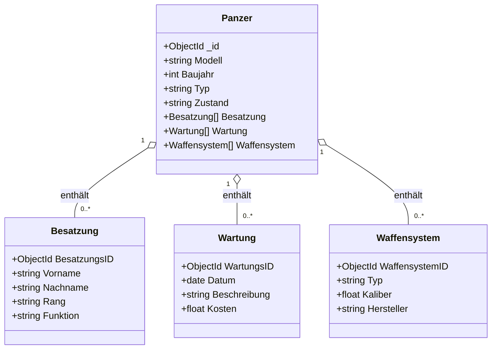
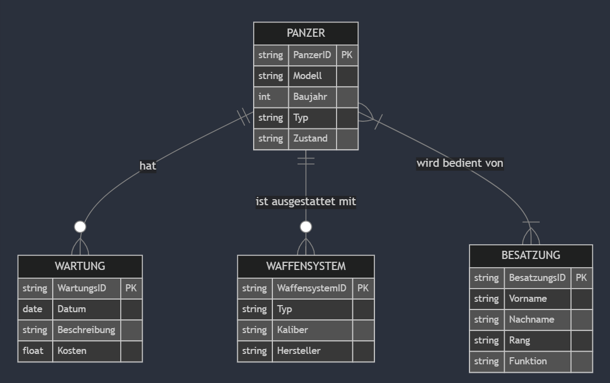
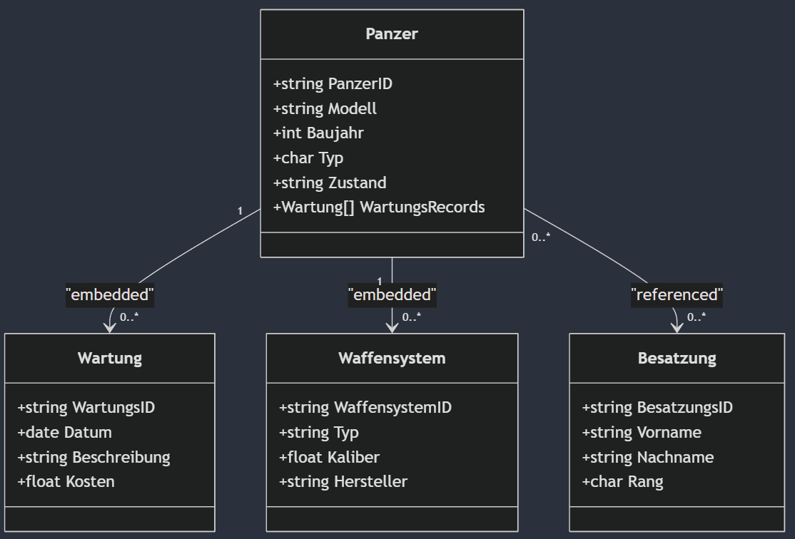
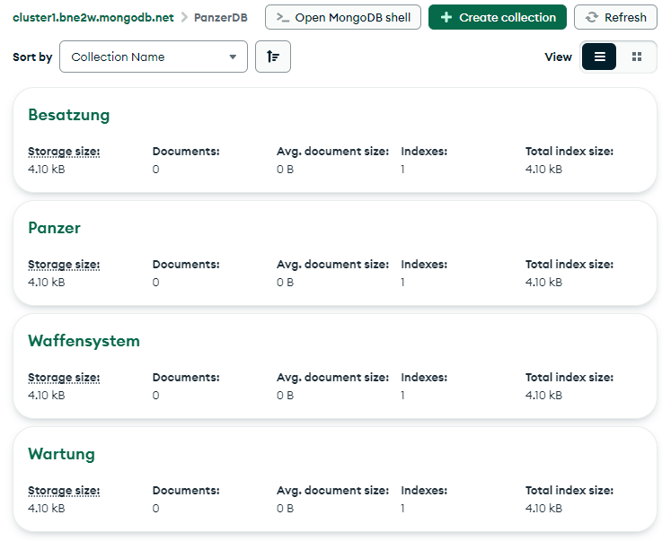

# Konzeptionelles Datenmodell: Panzer

Das folgende Mermaid-Diagramm stellt ein konzeptionelles Datenmodell zum Thema **"Panzer"** dar. Es umfasst vier Entitäten: **PANZER, BESATZUNG, WARTUNG** und **WAFFENSYSTEM**.

## **Entitäten und ihre Attribute**

### **PANZER**
Enthält grundlegende Informationen zu jedem Panzer:
- **Modell**
- **Baujahr**
- **Typ**
- **Zustand**

### **BESATZUNG**
Repräsentiert die Crew-Mitglieder, die die Panzer bedienen:
- **Name**
- **Rang**
- **Funktion**

### **WARTUNG**
Dokumentiert durchgeführte Wartungsarbeiten an den Panzern:
- **Datum**
- **Beschreibung**
- **Kosten**

### **WAFFENSYSTEM**
Erfasst die an den Panzern montierten Waffensysteme:
- **Typ**
- **Kaliber**
- **Hersteller**

## **Beziehungen zwischen den Entitäten**

1. **PANZER & BESATZUNG** → *N:N Beziehung*  
   - Ein Panzer kann von mehreren Besatzungsmitgliedern bedient werden.
   - Ein Besatzungsmitglied kann in mehreren Panzern eingesetzt werden.

2. **PANZER & WARTUNG** → *1:N Beziehung*  
   - Ein Panzer kann mehrere Wartungsarbeiten haben.

3. **PANZER & WAFFENSYSTEM** → *1:N Beziehung*  
   - Ein Panzer kann mehrere Waffensysteme haben.



Dieses Modell visualisiert die Beziehungen zwischen Panzern, Besatzung, Wartungsarbeiten und Waffensystemen, um eine strukturierte Datenhaltung zu ermöglichen.




# Logisches Datenmodell: Panzer

## **Kurze Beschreibung und Erklärung zur Verschachtelung**

### **Entitäten im logischen Modell**

- **Panzer:** Enthält grundlegende Daten zu jedem Panzer, wie Modell, Baujahr, Typ und Zustand.
- **Wartung:** Dokumentiert alle Wartungsarbeiten, die an einem Panzer durchgeführt wurden, mit Attributen wie `WartungsID`, `Datum` (als `date`-Datentyp), `Beschreibung` und `Kosten` (`float`).
- **Besatzung:** Erfasst die Crew-Mitglieder, die in den Panzern dienen, mit Attributen wie `BesatzungsID`, `Vorname`, `Nachname` und `Rang` (als `char`).
- **Waffensystem:** Beschreibt die Waffensysteme, die an einem Panzer montiert sind, inklusive `Typ`, `Kaliber` und `Hersteller`.

## **Verschachtelung im Datenmodell**

### **Warum wurden Wartungsdaten eingebettet?**
Die Wartungsdaten wurden als eingebettetes (`nested`) Array in das Panzer-Dokument integriert. Diese Wahl wurde aus folgenden Gründen getroffen:

- **Direkte Abfrage:** Wartungsaufzeichnungen sind eng mit einem Panzer verknüpft und werden in der Regel gemeinsam abgerufen.
- **Effizienz:** Ein eingebettetes Modell ermöglicht schnellen Zugriff auf alle Wartungsdaten, ohne separate Abfragen über mehrere Collections hinweg durchführen zu müssen.
- **MongoDB-Prinzip:** Es passt zum dokumentenorientierten Ansatz von MongoDB, das verwandte Daten oft in einem Dokument zusammenfasst.

### **Warum sind Besatzung und Waffensysteme separate Entitäten?**

- **Besatzung:** Wird als separate Entität geführt, da die Beziehung zwischen Panzer und Besatzung **N:N** ist:
  - Ein Besatzungsmitglied kann in mehreren Panzern dienen.
  - Ein Panzer kann über verschiedene Crew-Mitglieder verfügen.

- **Waffensystem:** Obwohl es möglich wäre, Waffensysteme in das Panzer-Dokument einzubetten, wurde hier die **Referenzierung** gewählt:
  - **Flexibilität:** Waffensysteme können in mehreren Panzern verwendet werden.
  - **Wiederverwendbarkeit:** Änderungen an einem Waffensystem betreffen alle Panzermodelle, die dieses System nutzen.

## **Datenmodell-Struktur in MongoDB (Beispiel)**

```json
{
  "Modell": "Leopard 2",
  "Baujahr": 2005,
  "Typ": "Kampfpanzer",
  "Zustand": "Einsatzbereit",
  "Wartung": [
    {
      "WartungsID": 1,
      "Datum": "2024-01-15",
      "Beschreibung": "Ölwechsel",
      "Kosten": 500.0
    },
    {
      "WartungsID": 2,
      "Datum": "2024-02-10",
      "Beschreibung": "Laufwerksprüfung",
      "Kosten": 1200.0
    }
  ],
  "Besatzung": [
    { "BesatzungsID": 101, "Vorname": "Max", "Nachname": "Mustermann", "Rang": "Leutnant" },
    { "BesatzungsID": 102, "Vorname": "Erik", "Nachname": "Schmidt", "Rang": "Feldwebel" }
  ],
  "Waffensystem": [
    { "WaffensystemID": 201, "Typ": "Kanone", "Kaliber": 120, "Hersteller": "Rheinmetall" }
  ]
}
```

Dieses Modell kombiniert die Vorteile von **Verschachtelung** für Wartungsdaten und **Referenzierung** für Besatzung und Waffensysteme, um Effizienz, Flexibilität und Datenkonsistenz zu gewährleisten.





## **Collections**
```js
use PanzerDB;

db.createCollection("Panzer");
db.createCollection("Besatzung");
db.createCollection("Wartung");
db.createCollection("Waffensystem");
```
