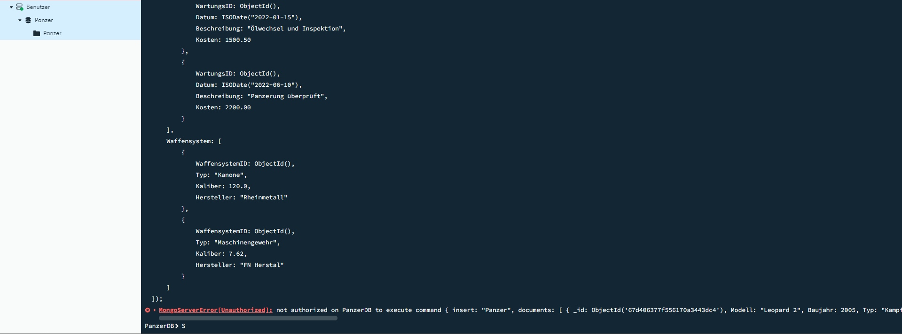
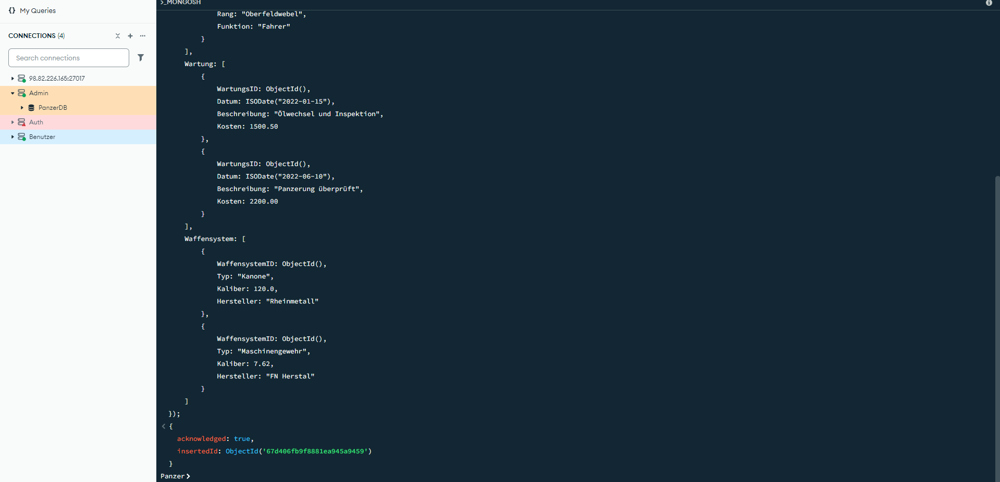
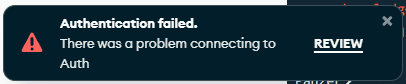
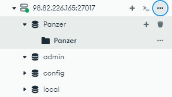

```bash
sudo mongosh --authenticationDatabase "admin" -u "admin" -p "admin"

use admin
db.grantRolesToUser("admin", [ { role: "dbAdminAnyDatabase", db: "admin" } ])
use PanzerDB
db.dropDatabase()


mongodump --host 98.82.226.165 --port 27017 --username admin --password admin --authenticationDatabase admin --db PanzerDB --out /tmp/backupPanzerDB
mongorestore --host 98.82.226.165 --port 27017 --username admin --password admin --authenticationDatabase admin --db PanzerDB /tmp/backupPanzerDB/PanzerDB
````


