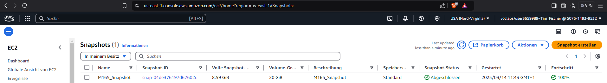
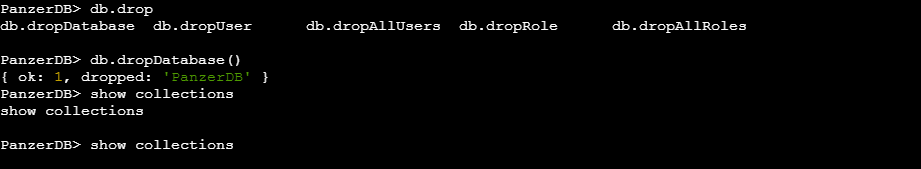
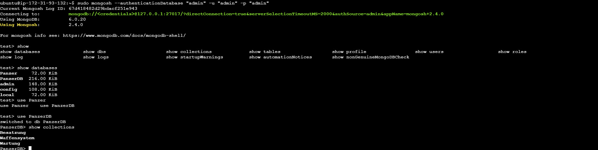
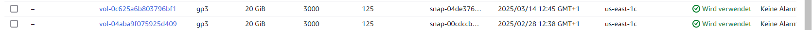
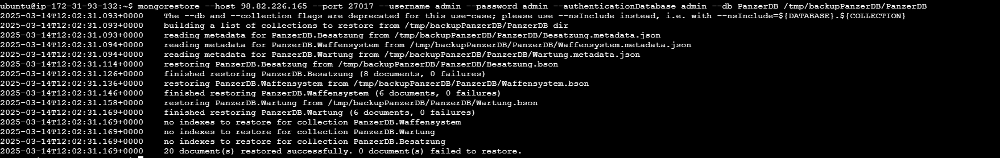

# Backup und Wiederherstellung – Dokumentation


---

## A) Backup Variante 1: AWS Snapshots

### 1. Snapshot erstellen in der AWS Console
- **Schritt:**
  - In der AWS Management Console unter **EC2 > Snapshots** ein Snapshot des EBS-Volumes erstellt, auf dem MongoDB läuft.
- **Dokumentation:**  
  
  *Screenshot: Der erstellte Snapshot mit Status "completed".*

### 2. Löschen einer Collection/Datenbank in MongoDB
- **Schritt:**
  - Verbindung mit MongoDB Compass / mongosh hergestellt.
  - In der Datenbank **PanzerDB** die Collection **Panzer** gelöscht:
  ```js
  use PanzerDB
  db.Panzer.drop();
  ```
- **Dokumentation:**  
  
  *Screenshot: Bestätigung, dass die Collection gelöscht wurde.*

### 3. Wiederherstellung des Volumens aus dem Snapshot
- **Schritt:**
  - In der AWS Console aus dem Snapshot ein neues Volume in der gleichen Availability Zone erstellt.
  - Das neue Volume an die EC2-Instanz angehängt und die Instanz neu gestartet.
- **Dokumentation:**  
  
  
  


---

## B) Backup Variante 2: MongoDB Database Tools (mongodump / mongorestore)

### 1. Backup erstellen mit mongodump
- **Schritt:**
  - Über die Kommandozeile ein Backup der Datenbank **PanzerDB** erstellt:
  ```bash
  mongodump --host 98.82.226.165 --port 27017 --username admin --password admin \
  --authenticationDatabase admin --db PanzerDB --out /tmp/backupPanzerDB
  ```
- **Dokumentation:**  
  
  *Screenshot: Ausgabe von mongodump und Ansicht des Backup-Ordners.*

### 2. Löschen der Datenbank
- **Schritt:**
  - Anschließend wurde die Datenbank in MongoDB gelöscht:
  ```js
  use PanzerDB
  db.dropDatabase();
  ```
- **Dokumentation:**  
    
  *Screenshot: Bestätigung, dass die Datenbank gelöscht wurde.*

### 3. Wiederherstellung mit mongorestore
- **Schritt:**
  - Um die Datenbank wiederherzustellen, wurde folgender Befehl verwendet:
  ```bash
  mongorestore --host 98.82.226.165 --port 27017 --username admin --password admin \
  --authenticationDatabase admin --db PanzerDB /tmp/backupPanzerDB/PanzerDB
  ```
- **Dokumentation:**  
  
  *Screenshot: Ausgabe von mongorestore und Überprüfung, dass die Datenbank und die Collections wieder vorhanden sind.*

---

## C) Zusammenfassung und Überprüfung

- **Schritt:**
  - Nach der Wiederherstellung (bei Variante 1 und 2) wurde überprüft, ob die Daten korrekt wiederhergestellt wurden, indem in der MongoDB-Shell `show collections`  ausgeführt wurde.
- **Dokumentation:**  
  
  *Screenshot: Bestätigung, dass alle Collections und Daten wie erwartet vorhanden sind.*
---


