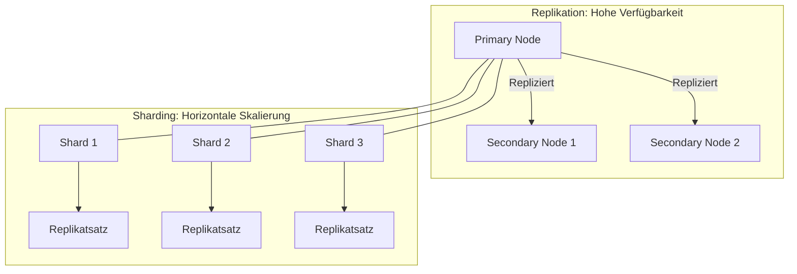

# Backup und Wiederherstellung – Dokumentation


---

## A) Backup Variante 1: AWS Snapshots

### 1. Snapshot erstellen in der AWS Console
- **Schritt:**
  - In der AWS Management Console unter **EC2 > Snapshots** ein Snapshot des EBS-Volumes erstellt, auf dem MongoDB läuft.
- **Dokumentation:**  
  
  *Screenshot: Der erstellte Snapshot mit Status "completed".*

### 2. Löschen einer Collection/Datenbank in MongoDB
- **Schritt:**
  - Verbindung mit MongoDB Compass / mongosh hergestellt.
  - In der Datenbank **PanzerDB** die Collection **Panzer** gelöscht:
  ```js
  use PanzerDB
  db.Panzer.drop();
  ```
- **Dokumentation:**  
  
  *Screenshot: Bestätigung, dass die Collection gelöscht wurde.*

### 3. Wiederherstellung des Volumens aus dem Snapshot
- **Schritt:**
  - In der AWS Console aus dem Snapshot ein neues Volume in der gleichen Availability Zone erstellt.
  - Das neue Volume an die EC2-Instanz angehängt und die Instanz neu gestartet.
- **Dokumentation:**  
  
  
  


---

## B) Backup Variante 2: MongoDB Database Tools (mongodump / mongorestore)

### 1. Backup erstellen mit mongodump
- **Schritt:**
  - Über die Kommandozeile ein Backup der Datenbank **PanzerDB** erstellt:
  ```bash
  mongodump --host 98.82.226.165 --port 27017 --username admin --password admin \
  --authenticationDatabase admin --db PanzerDB --out /tmp/backupPanzerDB
  ```
- **Dokumentation:**  
  
  *Screenshot: Ausgabe von mongodump und Ansicht des Backup-Ordners.*

### 2. Löschen der Datenbank
- **Schritt:**
  - Anschließend wurde die Datenbank in MongoDB gelöscht:
  ```js
  use PanzerDB
  db.dropDatabase();
  ```
- **Dokumentation:**  
    
  *Screenshot: Bestätigung, dass die Datenbank gelöscht wurde.*

### 3. Wiederherstellung mit mongorestore
- **Schritt:**
  - Um die Datenbank wiederherzustellen, wurde folgender Befehl verwendet:
  ```bash
  mongorestore --host 98.82.226.165 --port 27017 --username admin --password admin \
  --authenticationDatabase admin --db PanzerDB /tmp/backupPanzerDB/PanzerDB
  ```
- **Dokumentation:**  
  
  *Screenshot: Ausgabe von mongorestore und Überprüfung, dass die Datenbank und die Collections wieder vorhanden sind.*

---

## C) Skalierung in MongoDB: Replikation vs. Partition (Sharding)

### Replikation (Replication)
**Ziel:**
- Hohe Verfügbarkeit und Fehlertoleranz.

**Funktionsweise:**
- Alle Daten eines primären Servers werden auf mehrere sekundäre Server repliziert.
- **Primary:** Führt Schreibvorgänge aus.
- **Secondaries:** Kopieren alle Änderungen vom Primary und können Leseanfragen bedienen.

**Vorteile:**
- Automatische Übernahme bei Ausfall des Primary.
- Möglichkeit, Leseanfragen auf mehrere Knoten zu verteilen.

### Partition (Sharding)
**Ziel:**
- Horizontale Skalierung, um sehr große Datenmengen und hohe Lasten zu bewältigen.

**Funktionsweise:**
- Daten werden auf mehrere Shards (Datenpartitionen) verteilt, basierend auf einem Shard-Schlüssel.
- Jeder Shard kann wiederum einen eigenen Replikatsatz enthalten.

**Vorteile:**
- Verteilung der Last auf mehrere Server.
- Skalierung über mehrere Maschinen, um steigende Datenmengen effizient zu verwalten.



### Siemens
**Situation:**
Siemens betreibt komplexe industrielle Anwendungen (z. B. in der Fertigungsautomatisierung und im Energiemanagement), bei denen sowohl hohe Datenvolumen als auch extreme Verfügbarkeitsanforderungen bestehen. Eine MongoDB-basierte Applikation muss daher in der Lage sein, im Fehlerfall weiterhin verfügbar zu bleiben und gleichzeitig mit steigenden Datenmengen umzugehen.

**Empfehlung:**
- **Initialer Betrieb mit Replikation:**
  - Setzen Sie zunächst auf ein Replikations-Setup, um eine hohe Verfügbarkeit und Datenredundanz sicherzustellen.
  - Dies stellt sicher, dass bei Ausfällen eines Knotens automatisch ein anderer übernehmen kann.

- **Skalierung bei steigender Last durch Sharding:**
  - Wenn das Datenvolumen und die Anfragen weiter wachsen, sollte eine horizontale Skalierung durch Sharding in Betracht gezogen werden.
  - Jeder Shard sollte idealerweise auch einen eigenen Replikatsatz haben, um sowohl Skalierbarkeit als auch Ausfallsicherheit zu kombinieren.

---
