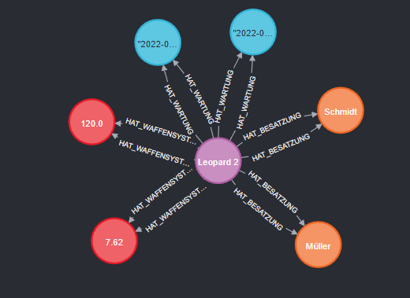

# Neo4j Datenmodellierung – Logisches Modell

Dieses Dokument beschreibt das logische Modell für Neo4j, basierend auf einem konzeptionellen Modell (z. B. für eine Schule oder ein anderes Szenario). Die Darstellung verzichtet auf konkrete Inhalte und verwendet stattdessen allgemeine Typen und Attribute, um die Modellierungstechniken in Neo4j zu erläutern.

---

## 1. Grundsätzliche Überlegungen

Im Gegensatz zu relationalen Datenbanken gibt es in Neo4j kein universell gültiges Datenmodell – stattdessen basiert die Modellierung auf der Graphstruktur. Dabei sind folgende Punkte zu beachten:

- **Referenzielle Integrität:**  
  In Graphdatenbanken erfolgt die Abbildung von Beziehungen direkt über Kanten, sodass Fremdschlüssel überflüssig werden.
  
- **Primärschlüssel und Fremdschlüssel:**  
  Relationale Datenbanken verwenden Primär- und Fremdschlüssel, um Integrität zu gewährleisten. In Neo4j sind diese Konzepte optional, da Knoten über Labels und Eigenschaften kategorisiert werden.  
  Neo4j generiert zudem intern zwei IDs:  
  - `<id>` – kann sich ändern und sollte nicht als dauerhafter Schlüssel genutzt werden.  
  - `<elementId>` – kann als Primärschlüssel genutzt werden, sofern nicht explizit eigene Werte vergeben werden.

---

## 2. Modellierungstechniken in Neo4j

### Knoten (Nodes)
- **Definition:**  
  Alle Entitäten werden als Knoten dargestellt. Die Unterscheidung erfolgt über Labels (z. B. `:Schueler`, `:Lehrer`, `:Klasse`).
- **Eigenschaften:**  
  Knoten speichern alle relevanten Attribute. Im Graph werden häufig nur wenige Attribute direkt am Knoten angezeigt (z. B. als "Caption"), während weitere Informationen im rechten Fenster verfügbar sind.
- **Beispiel:**  
  Ein Knoten `:Panzer` könnte die Eigenschaften `Modell`, `Baujahr`, `Typ` und `Zustand` besitzen.

### Kanten (Relationships)
- **Definition:**  
  Beziehungen zwischen Knoten werden als Kanten modelliert. Jede Kante erhält ebenfalls ein Label, das die Beziehung beschreibt (z. B. `:HAT_CREW`).
- **Eigenschaften:**  
  Kanten können ebenfalls Attribute haben, falls relevante Informationen (wie z. B. Zeitstempel oder Status) mit der Beziehung verbunden werden sollen.
- **Beispiel:**  
  Zwischen einem `:Panzer`-Knoten und einem `:Besatzung`-Knoten könnte die Kante `:HAT_CREW` stehen, die aussagt, dass dieser Panzer von einer bestimmten Besatzung bedient wird.

### Migration von SQL nach Neo4j
- **Regeln:**  
  - Hauptentitäten (ohne Transformationstabellen) werden zu Knoten mit entsprechenden Labels.  
  - Fremdschlüsselbeziehungen werden als gerichtete Kanten dargestellt.  
  - Transformationstabellen können als Kanten modelliert werden, wobei deren Attribute auf die Kante übertragen werden.
- **Vorteil:**  
  Alle Beziehungen werden direkt abgebildet, wodurch auf zusätzliche Felder (wie Fremdschlüssel) verzichtet werden kann.

---

## 3. Beispielhaftes Logisches Modell (ohne konkrete Inhalte)

In diesem Beispiel werden allgemeine Knoten und Kanten für ein Modell (z. B. Schule oder Panzer) dargestellt. 

### Attributverteilung
- **Knoten:**  
  Alle relevanten Informationen zu einer Entität (z. B. einem Panzer) werden in einem Knoten gespeichert. Dies ermöglicht eine schnelle Abfrage und direkte Visualisierung der wichtigsten Eigenschaften.

- **Kanten:**  
  Die Beziehungen zwischen den Knoten (z. B. ein Panzer, der von einer Besatzung bedient wird) werden als Kanten dargestellt. Kanten können zusätzliche Attribute enthalten, wenn diese Informationen zur Beziehung gehören.

---

## 4. Vergleich zu Relationalen Datenbanken

- **Referenzielle Integrität:**  
  In Neo4j wird diese durch direkte Kantenabbildung erreicht – es gibt keine Fremdschlüssel, die separat gepflegt werden müssen.

- **Primär-/Fremdschlüssel:**  
  Diese Konzepte sind in Graphdatenbanken weniger zentral, da Knoten über Labels und Eigenschaften identifiziert werden. Eine interne ID kann als Primärschlüssel dienen, ist aber oft nicht stabil genug für dauerhafte Referenzen.

- **Flexibilität:**  
  Die direkte Modellierung von Beziehungen als Kanten erlaubt eine flexiblere und intuitivere Darstellung komplexer Datenstrukturen.

---

## 5. Tools und Weitere Quellen

### Tools:
- **Neo4j Desktop:**  
  Zur Erstellung und Verwaltung von Graphdatenbanken.
- **Arrows.app:**  
  Zur graphischen Darstellung und zum Export von Knoten und Kanten als JSON oder Cypher.
- **Neo4j Aura:**  
  Cloud-basierte Neo4j-Instanz für den produktiven Einsatz.

### Weitere Quellen:
- **Neo4j Graph Modeling Guidelines**
- **Neo4j: Migration from Relational Databases**
- Literatur zur NoSQL-Datenmodellierung

---

